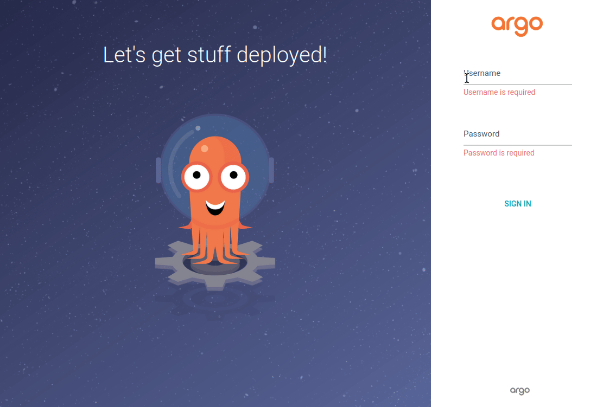

**ArgoCD інтерфейс**

**Після встановлення ArgoCD та забезпечення доступу до нього через виділений порт ми отримаємо доступ до GUI**.

$ kubectl port-forward svc/argocd-server -n argocd 8080:443
Forwarding from 127.0.0.1:8080 -> 8080
Forwarding from [::1]:8080 -> 8080

**Генеруємо пароль для доступу**

$ kubectl -n argocd get secrets argocd-initial-admin-secret -o jsonpath="{.data.password}" | base64 -d; echo
1mgfwqkwoagCXxxb

Вводимо логін **admin** та пароль, який ми отримали

